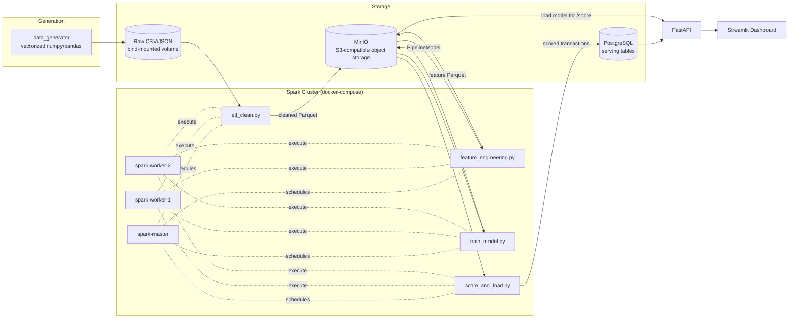

# Fraud Detection with Spark

A distributed fraud-detection pipeline built for a data-science portfolio: synthetic
"messy" transaction data flows through a real Spark cluster for ETL and feature
engineering, trains an MLlib model, serves predictions through FastAPI, and gets
visualized in a Streamlit dashboard — all wired together with Docker Compose.

**Stack:** Apache Spark 3.5 (standalone cluster) · MinIO (S3-compatible storage) ·
PostgreSQL · FastAPI · Streamlit · Docker Compose

## Why this exists

Real fraud-detection pipelines have to deal with messy, multi-source data before any
modeling happens. This project simulates that end to end:

1. A generator produces ~1.5M synthetic transactions across **three fake source
   systems**, each with its own schema, date format, currency, and set of data-quality
   problems.
2. A **real distributed Spark cluster** (1 master + 2 workers, in separate containers)
   cleans, unifies, and enriches that data with window-function features.
3. **Spark MLlib** trains a gradient-boosted tree classifier on the engineered features.
4. **FastAPI** serves the cleaned/scored data and exposes a live-scoring endpoint that
   loads the exact trained model.
5. **Streamlit** turns all of that into a dashboard: KPIs, a data-quality report, model
   performance, a transaction explorer, and an interactive fraud-scoring demo.

## Architecture



Why MinIO instead of just writing to a local folder: when the Spark driver and
executors are genuinely separate containers, each with its own independent bind mount
of the same host directory, Hadoop's local-filesystem commit protocol is unreliable
across their two views of "the same" path (deterministic `Mkdirs failed` errors under
concurrent writes). That's exactly the class of problem object storage exists to solve
— real distributed Spark deployments use HDFS or S3 for this reason, not a shared local
path. Small single-file JSON reports (`metrics.json`, `data_quality_report.json`) still
write straight to the bind mount since those come from plain driver-side Python code,
not Spark's distributed writer.

## The messy data, by source

| Source | Format | Problems |
|---|---|---|
| `core_transactions` | CSV | Mixed date formats (ISO/US/Unix), `$1,234.56`-style amount strings, missing merchant/city, exact duplicate rows, inconsistent category casing, occasional negative amounts |
| `mobile_events` | JSON lines | Different field names entirely (schema drift), nested device/geo object, mixed-case currency codes, a sprinkling of corrupt/truncated lines |
| `legacy_feed` | CSV | Multiple currencies needing conversion, MCC codes instead of category names, a different card-masking convention, occasional garbage future-dated timestamps |

All three sources share the same underlying pool of `account_id`s (under different
column names), so cross-source velocity features are meaningful once the ETL unifies
everything into one canonical schema.

**What the ETL fixed, on the last full run (1.5M raw rows):**

| Metric | Value |
|---|---|
| Raw rows ingested | 1,509,077 |
| Duplicate rows removed | 9,093 |
| Negative amounts corrected | 1,813 |
| Missing merchant imputed | 36,435 |
| Missing city imputed | 242,997 |
| Invalid/future timestamps dropped | 225 |
| Corrupt JSON lines dropped | 82 |
| **Final cleaned rows** | **1,499,677** |

## Fraud detection approach

Two layers, shown together in the API/dashboard:

- **Rule-based flags** — high velocity (≥5 txns/hour), amount z-score outlier,
  impossible travel (>900 km/h implied speed between consecutive transactions), odd
  hour (1–4am), new merchant for that account.
- **A trained model** — a `GBTClassifier` (Spark MLlib) on 18 features: amount,
  trailing 1h/24h transaction count & sum, amount z-score vs. the account's history,
  time since last transaction, geo-velocity, hour/day-of-week, and the rule flags
  themselves as additional signal.

The train/test split is **time-based** (train on the first ~80% of days, test on the
most recent ~20%), not random — a random split would leak future account behavior into
training and make the model look better than it would in production.

**Latest evaluation** (test set: the most recent ~20% of days, held out entirely from
training):

| Metric | Value |
|---|---|
| AUC-ROC | 0.782 |
| AUC-PR | 0.467 |
| Precision | 0.301 |
| Recall | 0.553 |
| F1 | 0.390 |

The fraud rate is intentionally kept low (~1.5%) with asymmetric label noise (some true
fraud goes unlabeled, a small share of legit transactions get mislabeled) so the
problem isn't trivially separable — a model that hits 99.9% accuracy on a 1.5%-positive
class isn't demonstrating anything. Top predictive features: trailing 1-hour
transaction count, transaction amount, trailing 1-hour amount sum, and category.

## Running it

Requires Docker and Docker Compose. Everything is memory-capped (`mem_limit` per
service) to stay well under 8GB of RAM for the full stack.

```bash
# 1. Generate the synthetic messy data (~1.5M rows, ~1-2 minutes)
python3 -m venv .venv-gen && .venv-gen/bin/pip install -r data_generator/requirements.txt
.venv-gen/bin/python data_generator/generate_data.py --rows 1500000
```

```bash
# 2. Copy env defaults and bring up the storage layer + Spark cluster
cp .env.example .env
docker compose up -d postgres spark-master spark-worker-1 spark-worker-2 minio minio-init
```

```bash
# 3. Run the full ETL -> feature engineering -> training -> scoring pipeline
#    (one-shot job, not a long-running service)
docker compose run --rm spark-pipeline
```

```bash
# 4. Bring up the API and dashboard
docker compose up -d api frontend
```

Then open:
- **Streamlit dashboard** — http://localhost:8501
- **FastAPI docs** — http://localhost:8000/docs
- **Spark master UI** — http://localhost:8080 (see the cluster's completed jobs)
- **MinIO console** — http://localhost:9001 (`minioadmin` / `minioadmin` by default)

For a fast local iteration loop, `generate_data.py --rows 50000` produces a small
sample in seconds so you can re-run the pipeline quickly while developing.

## Project structure

```
data_generator/       vectorized synthetic data generator (3 messy source systems)
spark_jobs/            etl_clean, feature_engineering, train_model, score_and_load
  common.py            shared Spark session config, schema constants, S3A/JDBC setup
api/                   FastAPI service: transaction queries, stats, live /score
frontend/              Streamlit dashboard (5 sections)
postgres/init.sql      serving-layer schema (transactions_scored, daily_stats)
docker-compose.yml     spark-master/worker x2, minio, postgres, api, frontend
```

## Design notes / known trade-offs

- **`/score` loads a real local SparkSession inside the API container** to run the
  exact `PipelineModel` the cluster trained, rather than a re-implemented copy. This
  adds startup latency (a few seconds on first call) in exchange for guaranteeing
  consistency between training and serving.
- **Legacy feed has no city, only country** — a realistic coverage gap. Geo-velocity
  fraud detection has reduced signal for that source, same as it would with a real
  legacy system.
- **Data volume is 1.5M rows by default**, not the full 5M originally planned — large
  enough to meaningfully exercise Spark's distributed window functions and shuffles,
  small enough to run comfortably in Docker on a typical laptop (~8GB RAM headroom).
  Bump `--rows` in the generator and the per-service `mem_limit`s in
  `docker-compose.yml` if you have more RAM to spare.
